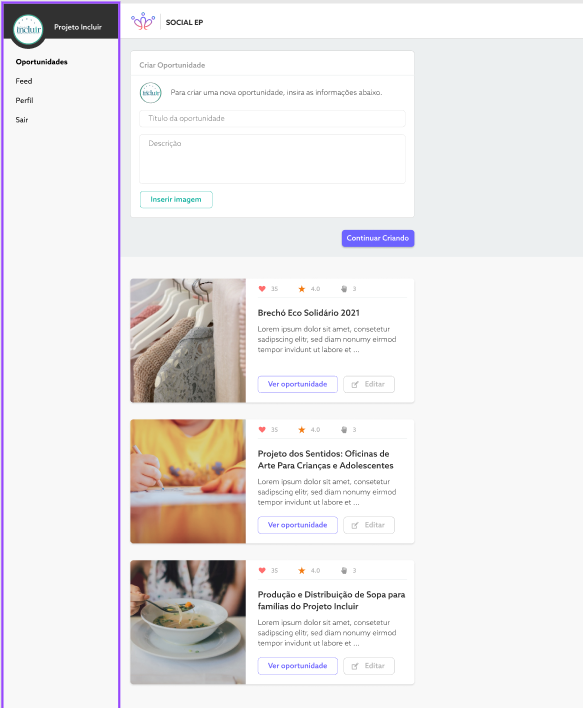
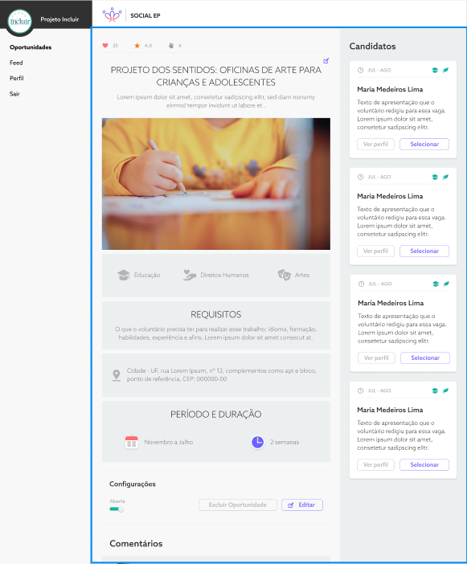
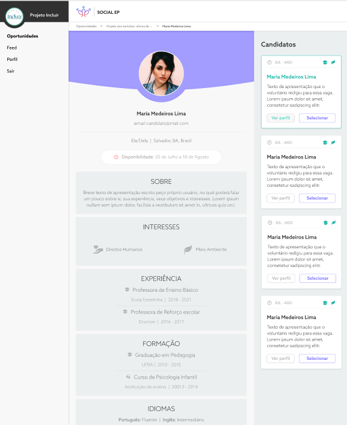

# **Sobre o Projeto**

Dashboard de gerenciamento. Aplicação que disponibiliza a ONGS um lugar onde postar notícias e eventos para se promover. Além de poder cadastrar e gerênciar vagas de trabalho voluntário, para que pessoas com interesse possam contribuir com sua mão de obra.

### **Feito Com**

-   [React](https://react.dev/)
-   [Styled Components](https://styled-components.com)

### **Funcionalidades**

-   [x] Criação e Gerenciamento de vagas
-   [x] Criação de Posts, notícias
-   [x] Personalização de Perfil da ONG

## **Capturas de Tela**

  
